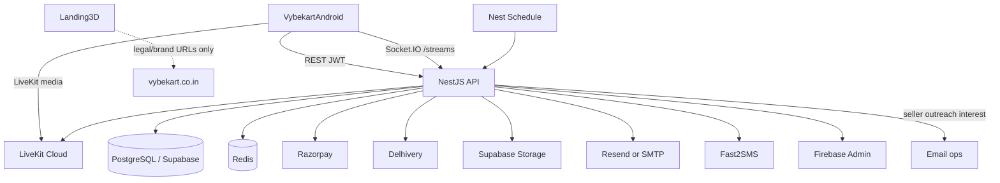

# Vybekart Backend — Architecture

> **Source of truth** for server architecture, modules, integrations, and folder layout.  
> Older `FLOW.md` describing IVS/Stripe is **historical** — production is LiveKit + Razorpay + Delhivery + Resend.

---

## 1. System context



**Deploy:** Render Docker web service + Redis Key Value; Supabase Postgres; LiveKit Cloud.  
**Local:** `docker-compose.yml` for Postgres 15 + Redis 7; Nest runs on host.

---

## 2. Tech stack

| Layer | Choice |
|-------|--------|
| Runtime | Node.js 22 (Docker image) |
| Framework | NestJS 11 + Express |
| Language | TypeScript 5.7 |
| ORM | Prisma 5.22 |
| DB | PostgreSQL (`DATABASE_URL`, `DIRECT_URL` for migrations) |
| Cache / OTP / refresh | Redis (`ioredis`) |
| Auth | Passport JWT + bcrypt + Redis refresh + OTP |
| Realtime | Socket.IO (`StreamsGateway`, namespace `streams`) |
| Live | LiveKit server SDK; optional legacy IVS flag off |
| Payments | Razorpay |
| Logistics | Delhivery Express API |
| Email | Resend HTTP API **or** Nodemailer SMTP |
| SMS | Fast2SMS DLT |
| Push | Firebase Admin |
| Storage | Local `uploads/` + Supabase Storage (public URLs) |
| PDF | PDFKit + DejaVu fonts |
| Images | sharp |
| Validation | class-validator / class-transformer; Joi env |
| Security | helmet, throttler, CORS |
| Jobs | `@nestjs/schedule` cron (no BullMQ) |
| Health | `@nestjs/terminus` |

---

## 3. Repository structure

```
Vybekart_Backend/
├── src/
│   ├── main.ts                 # bootstrap, pipes, helmet, CORS, uploads
│   ├── app.module.ts
│   ├── env.validation.ts
│   ├── admin/
│   ├── app-config/
│   ├── auth/
│   ├── buyers/
│   ├── categories/
│   ├── common/                 # request-id, dto, resend-fetch, public-base-url
│   ├── company/                # legal entity constants
│   ├── countries/
│   ├── delhivery/
│   ├── health/
│   ├── invoices/
│   ├── livekit/
│   ├── mail/ + templates/
│   ├── material-types/
│   ├── media/
│   ├── notifications/
│   ├── orders/
│   ├── payments/
│   ├── pricing/                # seller-payout-calculator (library)
│   ├── prisma/
│   ├── products/
│   ├── ratings/
│   ├── redis/
│   ├── replacements/
│   ├── reports/
│   ├── seller-emails/
│   ├── seller-outreach/
│   ├── sellers/
│   ├── storage/
│   ├── streams/                # REST + gateway
│   ├── support/
│   ├── users/
│   └── webhooks/               # LiveKit
├── prisma/schema.prisma + migrations/
├── scripts/                    # render-migrate, email demos, audits
├── Testing/                    # Phase2 specs, runbooks
├── postman/
├── Dockerfile, docker-compose.yml, render.yaml
├── PRD.md, Architecture.md, Rules.md, phases.md, design.md
├── API.md, README.md, TESTING.md   # supplementary; root five win on conflict
```

---

## 4. Module responsibilities (summary)

| Module | Responsibility |
|--------|----------------|
| `auth` | Login, register, OTP, refresh, FCM token |
| `buyers` | Profile, feed, addresses, follow, referrals, help |
| `sellers` | Profile, dashboard, bank/store/pickup, media, resubmit |
| `products` | Seller listings CRUD |
| `orders` | Cart, quote, checkout orchestration, buyer/seller order APIs, fulfillment |
| `payments` | Razorpay create/verify + replacement balance |
| `streams` | REST lifecycle + Socket.IO + LiveKit integration surface |
| `livekit` | Room/token/egress helpers |
| `replacements` | Buyer/seller/admin replacement pipeline |
| `ratings` | Buyer↔seller ratings + admin override |
| `admin` | KYC, users, packing videos, config hooks |
| `delhivery` | Shipment create/track/status |
| `mail` | Transport + templates + order notification orchestration |
| `notifications` | FCM + SMS + reminders |
| `storage` / `media` | Uploads, Supabase, cleanup |
| `invoices` | Tax PDF |
| `support` | FAQs, tickets, concerns |
| `reports` | CSV users + DB backup email |
| `seller-emails` / `seller-outreach` | Growth email + signed interest |
| `company` | Legal identity |
| `app-config` | Public Android min version |
| `health` | Liveness / DB |

Empty/legacy: `borzo/` — do not extend.

---

## 5. Auth architecture

```
Client → POST /auth/login|otp|register
       ← access JWT + refresh token id
Client → Authorization: Bearer <access>
Refresh → Redis key refresh:{tokenId}
OTP → Redis otp:{identifier} TTL
Guards → JwtAuthGuard → RolesGuard → SellerVerifiedGuard / BuyerAccessGuard
```

No cookie sessions; no OAuth.

---

## 6. Data architecture

- Prisma models: User (roles array), Buyer, Seller, Product, Stream*, Order*, PaymentCheckoutFailure, Replacement*, ratings, follow, notifications, FAQ/support, AppConfig, etc.  
- Enums for roles, verification, order/replacement statuses, stream replay, etc.  
- Migrations under `prisma/migrations/` — deploy via `scripts/render-migrate.sh` on Render start.

---

## 7. Realtime architecture

- HTTP creates stream + LiveKit room.  
- Clients connect Socket.IO to `/streams` with join/chat/like/viewer events.  
- Egress webhook `POST /webhooks/livekit` finalizes replay media in storage.

---

## 8. Email architecture

1. Prefer `RESEND_API_KEY` → `https://api.resend.com/emails`.  
2. Else Nodemailer SMTP (`MAIL_*`). Render free tier often blocks SMTP → **Resend in production**.  
3. Shared HTML shell: `mail/templates/vybekart-email-layout.ts` (`VYBE_THEME`).  
4. Feature templates: welcome, order, seller outreach, etc.  
5. Branding URLs from env (`ALPHA_WEBSITE_URL`, logo URLs, support emails).

---

## 9. Environment & config map (groups)

| Group | Examples |
|-------|----------|
| Core | `DATABASE_URL`, `DIRECT_URL`, `JWT_SECRET`, `JWT_REFRESH_SECRET`, `REDIS_URL` |
| Live | `LIVEKIT_*`, recording/S3-compatible egress settings |
| Storage | Supabase URL + service role + bucket |
| Mail | `RESEND_API_KEY`, `MAIL_*`, `NOREPLY_EMAIL`, `CONTACT_EMAIL`, `SUPPORT_EMAIL` |
| SMS | Fast2SMS + DLT template IDs; `OTP_ENV` |
| Push | `FIREBASE_SERVICE_ACCOUNT_JSON` |
| Pay | Razorpay key/secret |
| Logistics | Delhivery token/env |
| Brand/legal | `VYBEKART_*`, `ALPHA_*`, `APP_DOWNLOAD_URL` |
| Outreach | Seller outreach HMAC secrets / from addresses |

Validation: `src/env.validation.ts` (Joi). Never commit real secrets; rotate anything that was ever pasted into README/render samples.

---

## 10. Error & cross-cutting patterns

- Throw Nest HTTP exceptions; default JSON `{ statusCode, message, error }`.  
- Global ValidationPipe + ThrottlerGuard.  
- Request ID middleware on all routes.  
- No custom global filter required unless introducing a standard error envelope — document if added.

---

## 11. Deployment flow

1. Docker multi-stage build → `nest build` + assets.  
2. Start: migrate deploy → `node dist/...`.  
3. `render.yaml` defines service + Redis; secrets via Render dashboard.  
4. No GitHub Actions CI in-repo today — optional Phase 4.

---

## 12. Doc precedence

Root five docs **win** over `FLOW.md` / partial `API.md`. Keep `API.md` and Postman updated when adding endpoints; link from PRs.
